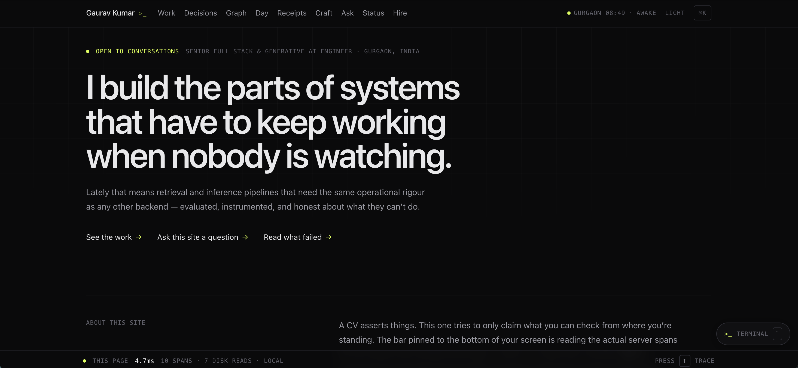
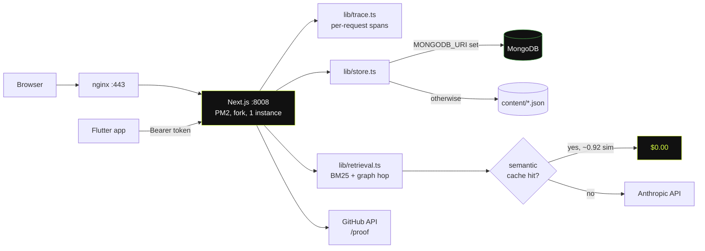

<div align="center">

# portfolio-v2 — the glass box

**A portfolio that shows its own internals.**

Real request traces. Live telemetry. Retrieval you can audit. A routine that runs while you watch it.
And a GitHub page that checks the rest of the site's claims against commit timestamps nobody can edit.

[](https://nextjs.org)
[](https://react.dev)
[](https://www.typescriptlang.org)
[](https://tailwindcss.com)
[](https://www.mongodb.com)
[](./mobile)
[](#why-there-are-no-web-fonts)

</div>



---

## The idea

Most portfolios assert. This one is built on a single rule:

> **Only claim things the visitor can verify from where they're standing.**

That rule produced every feature below. The bar pinned to the bottom of the screen isn't
decoration — it's reading the actual server spans for the request that drew the page you're on.
`/status` computes its percentiles from real traffic. `/ask` shows every passage it retrieved
and the score it gave each one. `/proof` takes the routine on `/day` and checks it against
real commit timestamps.

Where a number can't be measured honestly, it isn't shown.

---

## Feature tour

<details open>
<summary><b>🔬 The glass box — a real request tracer</b></summary>

<br>

`lib/trace.ts` is a small tracer built on React's per-request `cache()`. Every unit of server
work opens a named span: each disk read, each merge, each cache lookup, each Mongo round trip.

The strip at the bottom of every page shows the total. Press <kbd>T</kbd> for the waterfall,
which then merges in **real browser numbers** from the Performance API — TTFB, download, DOM
ready, FCP, LCP, transfer size.

```
● THIS PAGE  4.7ms  10 SPANS · 7 DISK READS · LOCAL        PRESS [T] TRACE
```

Kill a content file and you'll watch the span turn red. Nothing about it is simulated.

**Honest limitation, stated in the UI:** traces live in the memory of the instance that rendered
the page. On a multi-instance deploy the follow-up fetch can land elsewhere, and the strip says
*"trace not retained on this instance"* rather than inventing numbers.

</details>

<details>
<summary><b>⌨️ An actual terminal — press <kbd>`</kbd> or <kbd>⌘J</kbd></b></summary>

<br>

Not a gimmick — a genuine second navigation surface with history, tab-completion and real output.

| command | what it does |
|---|---|
| `neofetch` | the system card — role, projects, technologies, status |
| `ls work` · `ls decisions` · `ls skills` | list things |
| `cat kaizen-ai` | print a project in full, metrics included |
| `grep qdrant` | search projects, decisions and skills |
| `ask <question>` | runs the retrieval console inline, with sources and cost |
| `graph Qdrant` | what connects to what |
| `gh` | what the commit log says about him |
| `day` · `streak` | live routine state and consistency |
| `trace` · `stats` | browser timings and server health |
| `open /hire` · `theme` · `history` · `clear` | the rest |

`sudo` has an opinion. So does `rm`.

</details>

<details>
<summary><b>🧠 <code>/ask</code> — retrieval with the lid off</b></summary>

<br>

**Hybrid retrieval.** BM25 (k₁ = 1.5, b = 0.75) for lexical precision, then **one hop through the
knowledge graph** for recall. Ask about Qdrant and you reach every project that used it — even
the ones whose text never repeats the word. Every passage shows its score, its per-term BM25
contributions, and which half of the retrieval found it.

**Three layers stop it burning credits:**

1. **Semantic cache.** Questions are matched on *graph entities + question intent + lexical
   cosine*. Pure cosine wasn't enough — `"What has he built with Qdrant?"` vs
   `"which projects used Qdrant"` scored **0.41**, well under threshold, and would have paid
   twice. With entity and intent matching they score **0.92** and share one answer, while
   `"why did he pick Qdrant"` scores **0.69** and correctly gets its own call.
   Persisted to MongoDB when configured.

2. **Context budgeting.** Near-duplicate passages dropped, each passage capped, prompt stopped at
   a character budget. The UI reports exactly what got trimmed.

3. **Rate limit + spend ceiling.** Per-visitor token bucket (default 8/hour) and a hard daily
   budget (default $1). **Retrieval is local and free, so it is never limited** — when the budget
   runs out you still get exact passages, just no prose.

Without an `ANTHROPIC_API_KEY` nothing is generated at all: answers are assembled from verbatim
sentences out of the retrieved passages. Unhelpful is possible; hallucination isn't.

</details>

<details>
<summary><b>🕐 <code>/day</code> — a routine dial that runs live</b></summary>

<br>

A 24-hour instrument dial on IST that moves while you watch it, highlighting the active block and
counting down to the next.

**Free time is derived, not declared.** Anything no block covers renders as an unclaimed gap,
because a schedule that pretends every minute is accounted for is a schedule nobody keeps. On a
weekday that's exactly 30 minutes (09:00–09:15 and 11:45–12:00); on a Saturday it's most of the day.

Below the dial: the flattened timeline for any weekday, then streaks with 7-day bars and a 30-day
heatmap fed by check-ins. Sleep is excluded from scoring — taking credit for that would be cheating.

</details>

<details>
<summary><b>🕸️ <code>/graph</code> — the knowledge graph</b></summary>

<br>

Every technology, project, employer and architecture decision as one force-directed graph, derived
from the content — nothing drawn by hand. Drag nodes, click to isolate a neighbourhood, filter by
entity type.

The same edges power retrieval expansion on `/ask`, which is the point: it isn't a decoration that
happens to look like a graph, it's the index rendered.

</details>

<details>
<summary><b>📐 <code>/decisions</code> — architecture decision records</b></summary>

<br>

Eight real records: what was chosen, **what was rejected and why**, and what the trade-off cost.
APIM policy layers over Azure Functions, Managed Identity over Service Principals, embedding-based
deduplication over rule matching, Recursive Language Models over flat retrieval.

> A decision without its discarded alternatives isn't reviewable — it's just a fact the next
> engineer has to live with.

</details>

<details>
<summary><b>🧾 <code>/proof</code> — the receipts</b></summary>

<br>

**The one page that isn't self-reported.** It pulls live GitHub data and uses it to audit two of
the site's own claims.

**Claim 1 — the routine says code happens at midnight.** It plots real commit timestamps by hour
in IST, with the declared routine bands drawn *behind* the bars. Commits inside a block meant for
code are lime; commits outside one are red. Then it states the verdict plainly — including the
share landing during the 13:00–22:00 day job, which is deliberately not hidden.

**Claim 2 — the skills list.** Languages GitHub can corroborate, separated from ones it can't,
with the caveat stated up front: four years of private company work will never appear here, so
absence is not evidence of absence.

Plus what the commit log knows: night-owl share, longest silence, fix-to-feat ratio,
conventional-commit discipline, and the words he reaches for most.

Works with no token at 60 req/hr. A token raises it to 5,000 — **grant it zero scopes**, it needs none.

</details>

<details>
<summary><b>🎛️ <code>/craft</code> — four working simulations</b></summary>

<br>

Not screenshots. Drag something.

- **Backpressure, felt** — three strategies (block / drop-new / drop-oldest), queueing delay via Little's Law
- **Consistent hashing** — drag virtual nodes up and watch load even out; red keys are the ones that moved
- **Latency, to scale** — the numbers every engineer should know, at *true linear size*. Twelve of thirteen bars vanish
- **Why p99 is the number that matters** — Monte Carlo showing fan-out destroying your tail while the median sits still

</details>

<details>
<summary><b>🔐 <code>/admin</code> — full content management</b></summary>

<br>

Email + password, PBKDF2-hashed (210,000 iterations), stored alongside the content.
**The first account bootstraps itself** from `ADMIN_EMAIL` / `ADMIN_PASSWORD` the first time the
server starts against an empty store — nothing seeded into git, and a fresh deployment is never
locked out.

```
[admin] created the first admin from ADMIN_EMAIL / ADMIN_PASSWORD — you@example.com
```

Sessions are HMAC-signed tokens that work two ways: an httpOnly cookie for the browser,
`Authorization: Bearer` for the mobile app. Verification is pure crypto with no database lookup,
so it runs in edge middleware.

**Everything is editable** — create, edit, reorder, delete across every collection, driven by one
schema definition in `lib/admin-schema.ts` rather than seven bespoke forms:

| section | what it manages |
|---|---|
| **Overview** | storage backend, record counts, JSON→Mongo import, full export |
| **Profile** | identity, contact, availability, principles |
| **Projects** | case studies — tags, repeatable metric rows, links |
| **Decisions** | ADRs with repeatable "alternatives considered" rows |
| **Experience** | employment history |
| **Skills** | technology groups, tag editor |
| **Craft / Résumé history** | explainer metadata, past résumé diffs |
| **Day planner** | routine blocks, weekday rules, free-time preview, check-ins |
| **Résumé ingest** | PDF → Claude → diff → apply |
| **Account** | change email, name, password |

</details>

<details>
<summary><b>📄 Résumé ingest — PDF in, structured content out</b></summary>

<br>

Drop a PDF. It goes to Claude **as a document block** — no PDF parsing library, so a two-column
layout doesn't scramble — constrained by a tool schema that forbids inventing any metric not
literally in the file.

The extraction is then **diffed locally and deterministically** (no model involved) against the
live corpus:

| | |
|---|---|
| **newly learned** | technologies present in the résumé that the site had never heard of |
| **added** | new projects and roles |
| **changed** | title, location, years, role changes |

You pick which sections to write. **Hand-written narrative is never clobbered** — `tradeoffs` and
`wentWrong` on a project are left alone, because they aren't in a résumé and never will be.

The diff lands on `/growth`, and the new technologies surface as quick-chat chips on `/ask`.

</details>

<details>
<summary><b>📱 Flutter admin app</b></summary>

<br>

A phone client in [`mobile/`](./mobile) that does everything the web panel does.

**The forms aren't written in Dart.** The app fetches `/api/admin/schema` — the same
`lib/admin-schema.ts` that drives the web editors — and builds every form from it, including
repeatable object rows. Add a field on the server and it appears on the phone with no app release.

Login returns a 30-day bearer token kept in the platform keystore. See
[mobile/README.md](./mobile/README.md).

</details>

<details>
<summary><b>🔎 SEO for freelance discovery</b></summary>

<br>

JSON-LD `Person` + `ProfessionalService` + `OfferCatalog`, a `/hire` page with `FAQPage` schema
targeting freelance RAG/GenAI queries, generated `sitemap.xml` and `robots.txt`, dynamic OG images
via `next/og`, per-page canonical URLs and metadata.

</details>

<details>
<summary><b>⌨️ Keyboard everything</b></summary>

<br>

| key | action |
|---|---|
| <kbd>⌘K</kbd> | command palette — every page, project, decision and action |
| <kbd>`</kbd> / <kbd>⌘J</kbd> | terminal |
| <kbd>T</kbd> | request trace waterfall |
| <kbd>?</kbd> | shortcut list |
| <kbd>G</kbd> then <kbd>H W D G Y P C S A R B</kbd> | jump to home, work, decisions, graph, day, proof, craft, status, ask, résumé, about |

</details>

---

## Architecture



Every page renders **per request** (`dynamic = "force-dynamic"`). That's deliberate: the telemetry
describes *your* request, not a build artefact. Renders are ~15ms and almost entirely I/O.

---

## Quick start

```bash
git clone https://github.com/igaurav-dev/portfolio-v2.git
cd portfolio-v2
npm install
cp .env.example .env.local     # everything in it is optional
npm run dev                    # http://localhost:3000
```

**It runs with an empty `.env.local`.** Every integration degrades honestly instead of breaking:
no API key means `/ask` returns verbatim passages, no Mongo means JSON files, no GitHub username
means `/proof` shows a designed empty state.

> Drop your own screenshot at `docs/screenshot.png` to replace the one at the top.

### To open the admin panel

```bash
# .env.local
ADMIN_EMAIL=you@example.com
ADMIN_PASSWORD=a-long-password
ADMIN_SECRET=a-long-random-string-at-least-32-chars
```

Restart. The first account is created automatically and logged to the console. Change the password
from the Account page afterwards — the environment values are only a bootstrap.

---

## Configuration

All optional. See [`.env.example`](./.env.example).

<details open>
<summary><b>Core</b></summary>

| variable | effect if unset |
|---|---|
| `NEXT_PUBLIC_SITE_URL` | canonical tags, sitemap and OG URLs fall back to a placeholder |
| `ANTHROPIC_API_KEY` | `/ask` returns verbatim passages; résumé extraction disabled |
| `MONGODB_URI` | all content, check-ins and the answer cache use JSON files in `content/` and `data/` |
| `MONGODB_DB` | defaults to `portfolio` |

</details>

<details>
<summary><b>Admin</b></summary>

| variable | notes |
|---|---|
| `ADMIN_EMAIL` + `ADMIN_PASSWORD` | creates the first account on first start; without both, `/admin` cannot be opened |
| `ADMIN_NAME` | display name, defaults to the email's local part |
| `ADMIN_SECRET` | **signs session tokens.** Long and random. Changing it logs everyone out |
| `ADMIN_SESSION_TTL_MS` | browser session, default 12h |
| `ADMIN_MOBILE_TTL_MS` | mobile bearer token, default 30d |

</details>

<details>
<summary><b>/ask spend controls</b></summary>

| variable | default | notes |
|---|---|---|
| `ASK_RATE_LIMIT` | `8` | synthesised answers per hour per visitor |
| `ASK_DAILY_BUDGET_USD` | `1` | hard ceiling across all visitors |
| `ASK_CACHE_THRESHOLD` | `0.84` | similarity required for a cache hit |
| `ASK_CACHE_TTL_MS` | 7 days | how long a cached answer stays valid |
| `ASK_CONTEXT_CHARS` | `3600` | prompt context budget |
| `ASK_RATE_IN_PER_MTOK` / `_OUT_` | `3` / `15` | $/M tokens, for the cost readout |

</details>

<details>
<summary><b>GitHub (/proof)</b></summary>

| variable | notes |
|---|---|
| `GITHUB_USERNAME` | required for `/proof` to show anything |
| `GITHUB_TOKEN` | raises 60 → 5,000 req/hr. **Grant it zero scopes** — public data needs none |
| `GITHUB_TZ` | timezone for the commit-hour histogram, default `Asia/Kolkata` |
| `PORTFOLIO_REPO` | the repo shown in the footer card |

</details>

---

## Managing content

Two routes, and they don't conflict.

**1. Through `/admin`** — writes to the store, live on the next request, no rebuild.
**2. Through the files** — edit `content/*.json`, commit, redeploy.

Once `MONGODB_URI` is set the database becomes the source of truth and the JSON files are seed
data. Collections **seed themselves from those files on first read against an empty database**, so
a fresh Mongo comes up already populated — nothing to run. Use **Export everything as JSON** in the
admin to pull edits back into git.

| file / collection | drives |
|---|---|
| `profile.json` | identity, contact, principles |
| `projects.json` | `/work` and every case study |
| `decisions.json` | `/decisions` |
| `timeline.json` | `/resume` and `/about` |
| `skills.json` | technology nodes on `/graph`, checked against code on `/proof` |
| `routine.json` | the `/day` dial |
| `craft.json` | explainer metadata |
| `deltas.json` | `/growth` — written by résumé ingest |

### The two fields nothing can fill for you

**`projects[].wentWrong`** — empty by default. The section renders only when filled, and it's the
single highest-value thing on the page. A list of successes tells someone what you finished; the
failures show how you reason.

**`projects[].tradeoffs`** — the cost you accepted, not the win you got.

---

## Deployment

Full guide in **[DEPLOY.md](./DEPLOY.md)**. Short version — PM2 behind nginx on port 8008:

```bash
./deploy/setup-server.sh    # once: pm2, log rotation, start on boot
./deploy/deploy.sh          # install → typecheck → build → reload
sudo cp deploy/nginx.conf /etc/nginx/sites-available/portfolio
```

`deploy.sh` builds *before* reloading, so a broken build leaves the running site untouched, then
polls `/api/health` and prints the real status.

<details>
<summary><b>Three nginx settings that will bite you if you change them</b></summary>

<br>

| setting | why |
|---|---|
| `client_max_body_size 10M` | nginx defaults to **1MB** — résumé uploads get a 413 before Node sees them |
| `X-Forwarded-For` | `lib/ratelimit.ts` reads it to identify a visitor. Drop it and everyone shares one bucket |
| `proxy_read_timeout 120s` on `/api/admin/` | résumé extraction legitimately runs a minute; the 60s default cuts it off |

</details>

<details>
<summary><b>Why one PM2 instance (this is deliberate)</b></summary>

<br>

`ecosystem.config.cjs` sets `instances: 1` and `exec_mode: "fork"`. Three things live in the memory
of a single process:

- **`lib/trace.ts`** — request traces. Two workers means half the `/api/trace` calls land on the
  process that didn't render the page.
- **`lib/ratelimit.ts`** — the token bucket and spend meter. Two workers doubles the effective rate
  limit and makes the ceiling meaningless.
- **`lib/semantic-cache.ts`** — the in-process cache half. Split it and the hit rate halves, which
  costs real money.

One Node process handles this comfortably — a render is ~15ms and almost entirely I/O.

**The cost:** a deploy restarts that process, so there's roughly a one-second gap. Measured: **1
dropped request in 40** during a reload. nginx `proxy_next_upstream` retries soften it but don't
eliminate it. For true zero-downtime, run blue/green on 8009, or move those three stores to Redis
and switch to cluster mode.

</details>

---

## Project structure

```
app/
  page.tsx                unified changelog — ships, decisions, learnings, roles
  work/[slug]/            case studies, each ending in trade-offs
  decisions/              architecture decision records
  graph/                  knowledge graph explorer
  day/                    live routine dial + streaks
  proof/                  receipts — GitHub vs the claims
  ask/  craft/  hire/  growth/  status/  resume/  about/
  admin/                  content console (password-gated)
  api/{ask,health,trace,routine,github}/
  api/admin/{login,me,account,schema,records,routine,checkin,upload,extract,apply,migrate,export}/

lib/
  trace.ts                tracer + aggregate telemetry
  store.ts                content repository — Mongo or files, seeding, CRUD
  db.ts                   MongoDB connection + check-ins
  content.ts              typed content layer
  retrieval.ts            BM25 + graph expansion
  graph.ts                entity/edge derivation
  semantic-cache.ts       similarity, intent families, context budgeting
  ratelimit.ts            token bucket + cost metering
  routine-core.ts         pure routine logic (client-safe)
  resume.ts               PDF extraction + deterministic diffing
  auth.ts / session.ts    admin records + HMAC session crypto (edge-safe)
  admin-schema.ts         field definitions driving web AND mobile forms

components/craft/         backpressure · hash-ring · latency-scale · tail-latency
content/*.json            everything you edit
mobile/                   Flutter admin client
deploy/                   nginx configs, deploy/rollback/setup scripts
instrumentation.ts        creates the first admin at server startup
ecosystem.config.cjs      PM2 — port 8008, fork mode, 1 instance
```

---

## API reference

<details>
<summary><b>Public</b></summary>

| method | route | returns |
|---|---|---|
| `POST` | `/api/ask` | answer, mode, retrieval provenance, cost, quota, cache info |
| `GET` | `/api/ask` | current quota and budget without spending anything |
| `GET` | `/api/health` | check results, store backend, cache stats, uptime |
| `GET` | `/api/trace?id=` | server spans for a rendered page |
| `GET` | `/api/routine` | current block, next block, free time, streaks |
| `GET` | `/api/github` | compact commit stats for the terminal's `gh` |

</details>

<details>
<summary><b>Admin — cookie or <code>Authorization: Bearer</code></b></summary>

| method | route | purpose |
|---|---|---|
| `POST` | `/api/admin/login` | `{ email, password, client: "web" \| "mobile" }` |
| `GET` | `/api/admin/me` | session check + capabilities |
| `GET` `PUT` | `/api/admin/account` | change email, name, password |
| `GET` | `/api/admin/schema` | field definitions — drives both clients' forms |
| `GET` `PUT` `DELETE` `PATCH` | `/api/admin/records?collection=` | CRUD + reorder |
| `GET` `PUT` | `/api/admin/routine` | routine blocks, with overlap validation |
| `GET` `POST` `DELETE` | `/api/admin/checkin` | daily check-ins |
| `GET` `POST` | `/api/admin/upload` | résumé PDFs |
| `POST` | `/api/admin/extract` | PDF → structured extraction + diff |
| `POST` | `/api/admin/apply` | write selected sections |
| `POST` | `/api/admin/migrate` | import JSON → MongoDB |
| `GET` | `/api/admin/export` | everything back out as JSON |

</details>

---

## Troubleshooting

<details>
<summary><b><code>/admin</code> redirects to login and nothing works</b></summary>

<br>

`ADMIN_EMAIL` and `ADMIN_PASSWORD` must **both** be set before the first start, and the server
restarted. Check the console for `[admin] created the first admin…`. If it says
*"no admin exists and ADMIN_EMAIL / ADMIN_PASSWORD are not both set"*, that's your answer.

Locked out? Delete the `admins` collection (or `data/admins.json`) and restart — it rebuilds from
the environment.

</details>

<details>
<summary><b>Admin saves fail with a write error</b></summary>

<br>

Serverless filesystems are read-only. Either set `MONGODB_URI`, or run the admin locally and commit
the JSON. Every write path returns this as a `hint` rather than a generic 500.

</details>

<details>
<summary><b><code>Module not found: Can't resolve 'net'</code></b></summary>

<br>

Something imported the Mongo driver into the edge runtime. `middleware.ts` must import from
`lib/session.ts` (pure crypto, no database) — never `lib/auth.ts`. `next.config.ts` also marks
`mongodb` as a server-external package.

</details>

<details>
<summary><b><code>Cannot find module '../lightningcss.linux-arm64-gnu.node'</code></b></summary>

<br>

`node_modules` was installed on a different platform. `rm -rf node_modules && npm install`.

</details>

<details>
<summary><b>Résumé upload returns 413</b></summary>

<br>

nginx `client_max_body_size` defaults to 1MB. The config in `deploy/nginx.conf` sets it to 10M.

</details>

<details>
<summary><b>Everyone shares one rate limit</b></summary>

<br>

The proxy isn't forwarding `X-Forwarded-For`, so every visitor resolves to the same key.

</details>

---

## Design notes

<details>
<summary><b>Why there are no web fonts</b></summary>

<br>

Zero font requests, zero layout shift, and one less thing between the visitor and the content. The
type is a system stack with a monospace fallback for anything numeric. For a site whose entire
argument is measured performance, shipping 200KB of woff2 would undercut the point.

</details>

<details>
<summary><b>Why there's no 3D</b></summary>

<br>

For a backend and AI engineer, a WebGL set piece proves the wrong skill — it demonstrates Three.js,
which isn't the job — and costs weeks. The argument here is made by the instrumentation instead.

</details>

<details>
<summary><b>Deliberate omissions</b></summary>

<br>

No analytics. No cookies beyond the admin session. No consent banner. No typing animation. No skill
bars — a chart asserting "React 90%" isn't evidence of anything.

</details>

---

## Roadmap

- [ ] Push spans to Redis or an OTel collector so traces survive multi-instance deploys
- [ ] Blue/green deploy on 8009 for genuinely zero-downtime releases
- [ ] Embeddings-backed semantic cache to catch paraphrases with no shared entity
- [ ] Fill in `wentWrong` on every project

---

<div align="center">

**Built by [Gaurav Kumar](https://github.com/igaurav-dev)** · Senior Full Stack & Generative AI Engineer

The numbers at the bottom of the screen are real.

</div>
